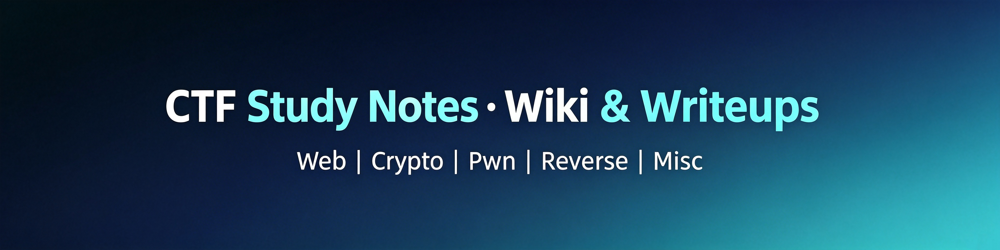

<p align="center">
  
</p>

<p align="center">
  
  
  
  
  
  
  
</p>

<h1 align="center">CTF Wiki 🛡️</h1>
<p align="center"><b>一个面向 LLM Agent 的 CTF 知识图谱</b><br/>
CTF Knowledge Graph for LLM Agents — Built on Karpathy's 3-Layer Wiki Architecture</p>

---

## 📋 Features

- **Agent-optimized** — 每页 `triggers` 字段让 LLM Agent 秒级定位相关知识点
- **Obsidian-native** — 完整 [[wikilink]] 交叉引用，`Ctrl+O` 随手搜索
- **Full PoC included** — Skill 参考页含完整 Exploit 代码片段
- **Multi-source synthesis** — 来自 CTF WP、GHSA、CVE、学术文章的交叉验证
- **Continuous ingest** — 每场竞赛结束后快速摄入新知识

## 📊 Stats

| 统计项 | 数值 |
|--------|------|
| 命名技术/赛题页 | 107 页 |
| Skill 深度参考（含 PoC 代码） | 99 个 |
| Command 解题指南 | 11 个 |
| GHSA 概念合成页 | 8 张（覆盖 ~1124 条目） |
| CVE 产品漏洞索引 | 2 张（覆盖 ~400 个 CVE） |
| **总计** | **221 个 markdown 文件** |

## 🗂️ Coverage

| 赛道 | 容量 | 覆盖内容 |
|------|------|---------|
| **Web** | 30+ 页 | SQLi, SSTI, SSRF, JWT, 反序列化, XSS, 原型链, CSRF, 文件上传... |
| **Crypto** | 5 页 | RSA (Wiener/Coppersmith), ECC, 格 (LLL), PRNG, ZKP, 流/经典密码... |
| **Pwn** | 6 页 | ret2win, UAF, ROP, 堆利用 (House 系列), 内核, 沙箱逃逸... |
| **Reverse** | 16 页 | APK, SMC, 字节码, PyInstaller, 固件, 自定义 VM, Ren'Py, Unity... |
| **Forensics** | 6 页 | 隐写 (LSB/Arnold), 网络/磁盘/内存/日志取证, 信号分析... |
| **Misc** | 7 页 | 编码, PyJail, BashJail, 游戏 (Z3), RF/SDR, DNS 攻击... |
| **AI-ML** | 15 页 | Agent 架构, Prompt 注入, 对抗样本, 模型攻击, LWE... |
| **Cloud Security** | 5 页 | 容器逃逸, K8s, Nacos, vCenter, MinIO, 数据库后渗透... |
| **Code Audit** | 15 页 | OWASP Top 10, CVE 模式, FastAdmin/ShowDoc/UEditor... |
| **Malware** | Skill | C2 协议, PE/.NET, 反混淆, shellcode, YARA... |
| **OSINT** | Skill | 社交媒体, DNS, 地理定位, Google Dorking, Wayback... |

## 🏛️ Architecture

```
/
├── raw/                # Source Layer — 不可变源文档
├── wiki/               # Wiki Layer — markdown 知识页面
│   ├── index.md        # 目录索引（Agent 检索入口）
│   ├── log.md          # 变更日志
│   ├── {11个赛道}       # 按赛道子目录
│   └── ctf/            # 竞赛实体页
├── AGENTS.md           # Schema Layer — LLM Agent 工作规范
└── LLM Wiki.md         # Karpathy 方法论原始文档
```

每页格式：`frontmatter` (含 `triggers` 字段) → `Key Points` → `Exploit` 代码 → `Connections` (交叉引用)。

## 🚀 Quick Start

```bash
# 克隆
git clone https://github.com/doudou0308/ctf-wiki.git

# 用 Obsidian 打开
# Obsidian → Open folder as vault → 选择 ctf-wiki/
```

### 👤 个人查阅
`Ctrl+O` 搜索或浏览 `wiki/index.md` 分类目录。

### 🤖 LLM Agent 调用
配置 Agent 的 Workspace Rules 指向 `wiki/`，Agent 通过 `SearchCodebase`/`Grep` 匹配 `triggers` 字段自动检索。

### 📥 摄入新知识
```
1. 源文档放入 raw/
2. Agent 按 AGENTS.md 规则 → 摄入到 wiki/ 对应赛道
3. 更新 index.md + log.md
```

---

<a href="https://github.com/doudou0308/ctf-wiki/stargazers">
  
</a>
